# E-Commerce Management System for Fashion

## Overview

## The **E-Commerce Management System for Fashion** is a comprehensive platform designed to deliver a seamless shopping experience for users while equipping sellers with robust management tools. By leveraging advanced technologies and prioritizing a user-centered design, the system ensures optimal performance, enhanced security, and scalability.

## Technologies Used

- **Frontend**: Next.js
- **Backend**: Golang
- **Database**: PostgreSQL
- **Other Tools**: AWS S3, Docker

---

## Use Case Diagram

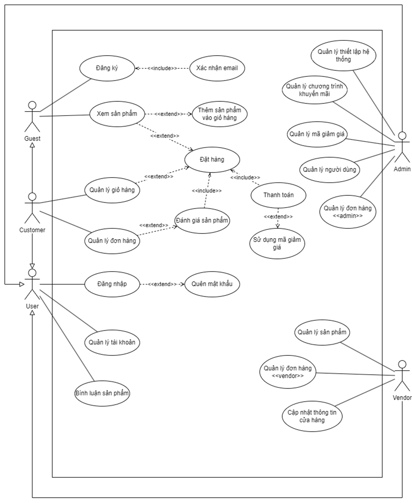

---

## Screenshots

### **Authentication**

- **Login Interface**  
  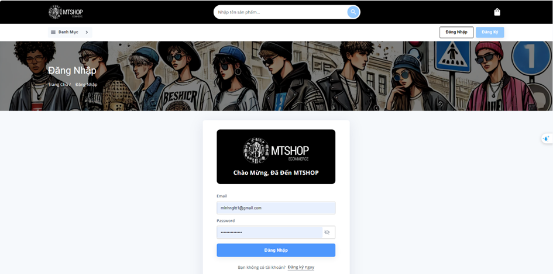

- **Registration Interface**  
  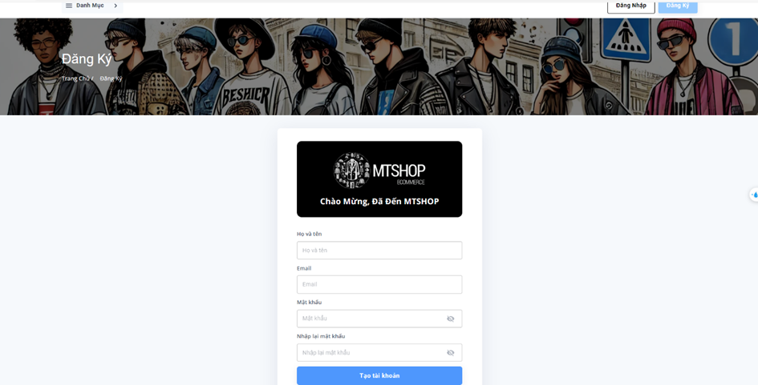

### **Homepage**

- **Home Interface**  
  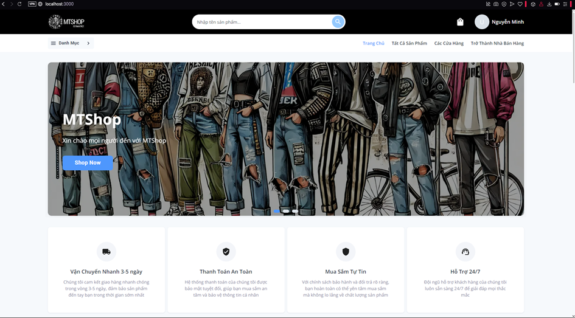

### **Products**

- **All Products Interface**  
  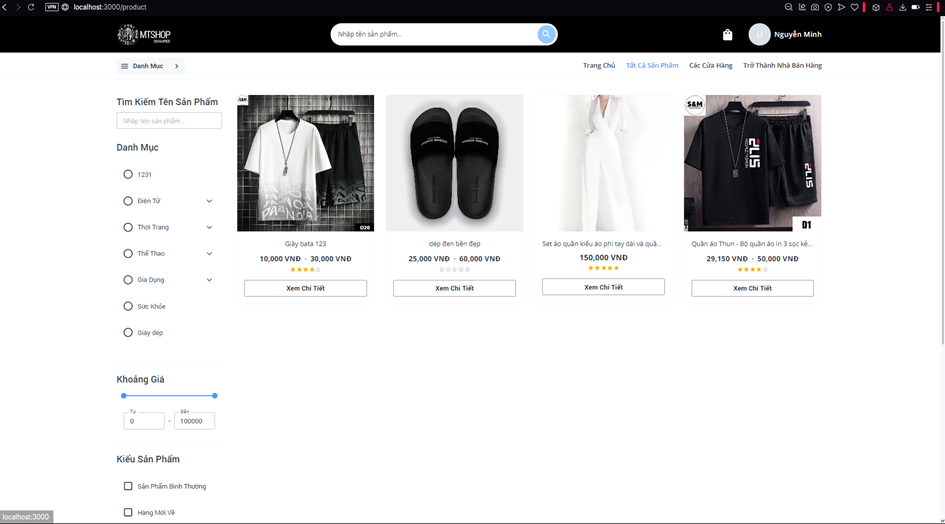

- **Product Details Interface**  
  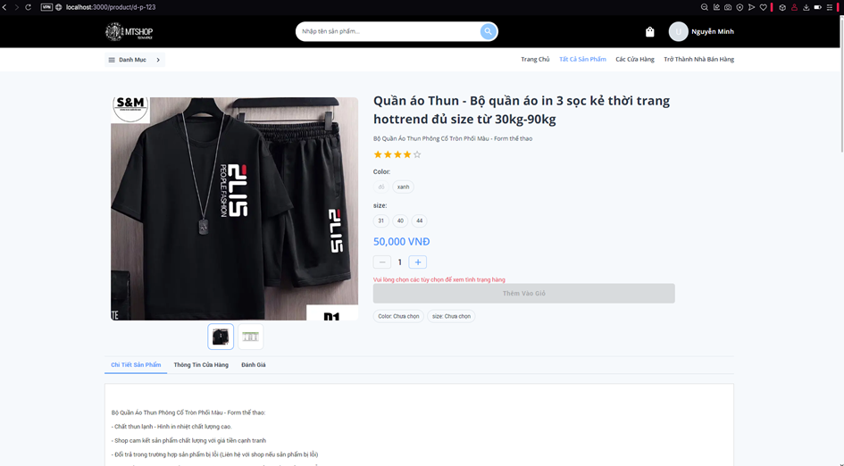

### **Seller**

- **Seller Details Interface**  
  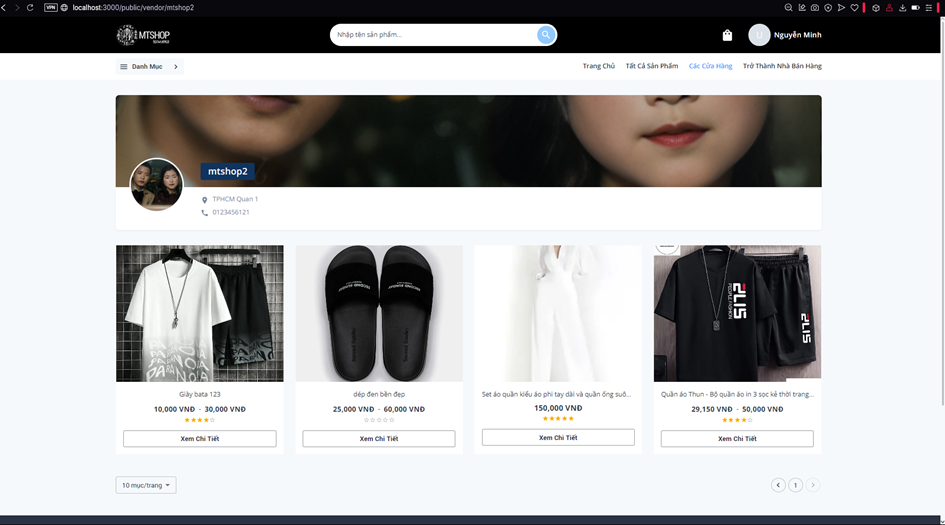

- **Order List Interface**  
  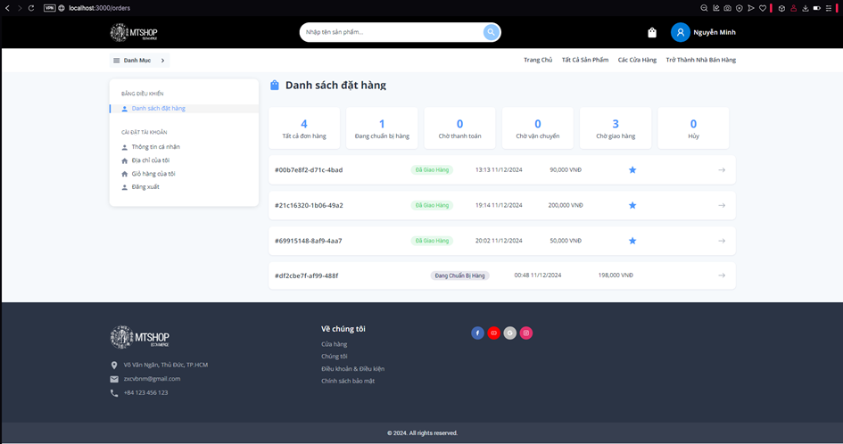

- **Seller Dashboard**  
  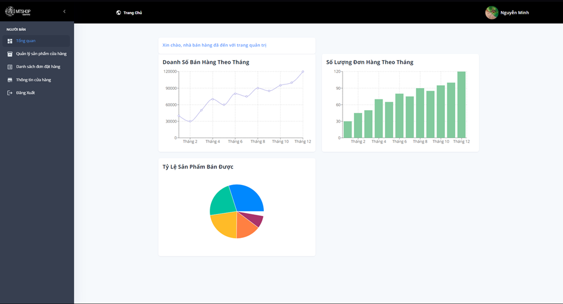

- **Product Management Interface**  
  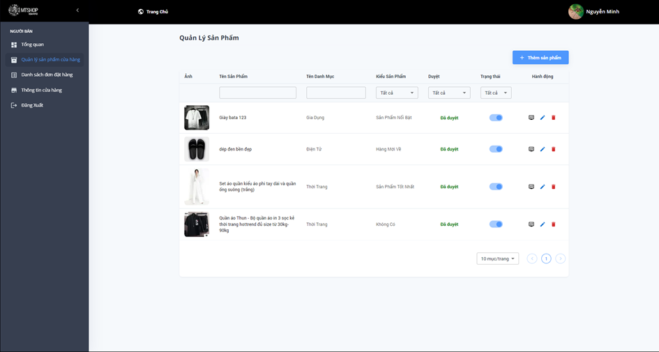

- **Order Details Interface**  
  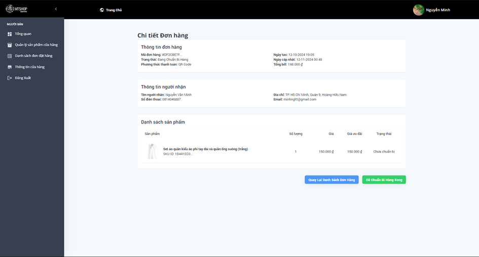

- **Store Information Editing Interface**  
  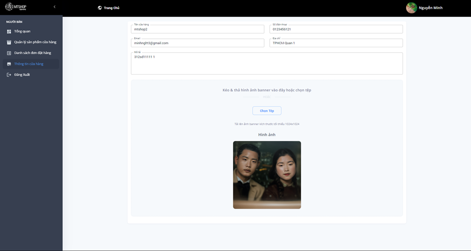
